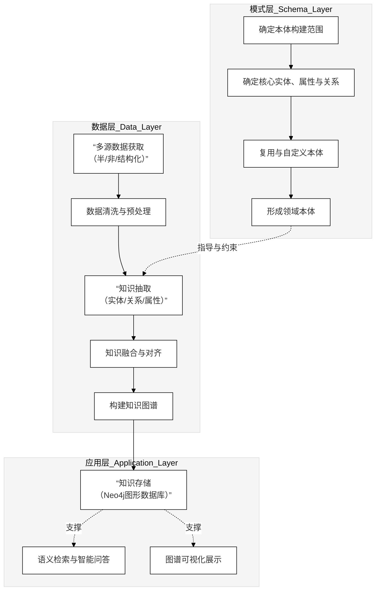

```mermaid
flowchart TB
    %% BERT 模型总体结构示意图

    subgraph L0["输入表示层（Input Representation）"]
        direction TB
        X["原始文本序列"]
        TK["分词 / 子词切分"]
        ID["Token IDs"]
        SID["Segment IDs"]
        PID["Position IDs"]
        X --> TK --> ID
        ID --> SID
        ID --> PID
    end

    subgraph L1["嵌入层（Embedding Layer）"]
        direction TB
        TE["词嵌入"]
        SE["句段嵌入"]
        PE["位置嵌入"]
        SUM["嵌入向量相加 + LayerNorm"]
        ID --> TE
        SID --> SE
        PID --> PE
        TE --> SUM
        SE --> SUM
        PE --> SUM
    end

    subgraph L2["编码层（L 层 Transformer Encoder）"]
        direction TB
        ENC1["第 1 层 Encoder Layer"]
        ENC2["第 2 层 Encoder Layer"]
        MID["⋮"]
        ENCL["第 L 层 Encoder Layer"]
        ENC1 --> ENC2 --> MID --> ENCL
    end

    subgraph L3["预训练任务与下游任务层"]
        direction TB
        CLS["[CLS] 句级表示"]
        TOK["Token 级表示"]
        MLM["掩码语言模型头"]
        NSP["句对 / 文本分类头"]
        NER["序列标注任务头"]
        CLS --> NSP
        CLS --> MLM
        TOK --> MLM
        TOK --> NER
    end

    L0 --> L1 --> L2
    L2 --> CLS
    L2 --> TOK
