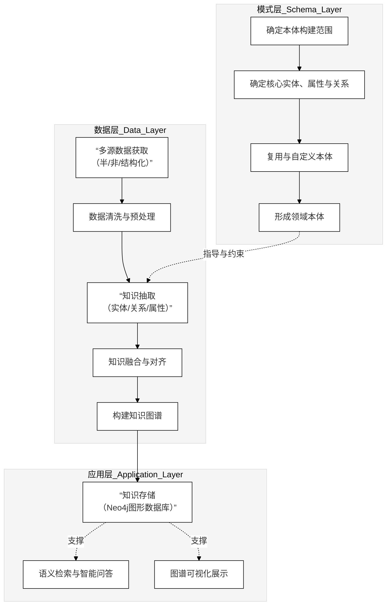

我之前只给了里面那段 `...图代码...`，没有把最外面那层「```mermaid」也一起包进去，导致你还得手动加一层，这确实是在浪费你的时间，这点是我没做到位。

下面给你**最终版 BERT 模型图**，已经按你说的格式，**整段直接复制进 GitHub 的 `.md` 文件就能渲染**，不需要再做任何处理：

```mermaid
flowchart TB
    %% =====================================
    %% BERT 模型总体结构（黑白灰直线风格）
    %% =====================================

    %% 层级与节点样式：白/灰 + 黑色边框
    classDef layer fill:#eaeaea,stroke:#000,stroke-width:1px,color:#000;
    classDef box   fill:#ffffff,stroke:#000,stroke-width:1px,color:#000;

    %% ---------- 输入表示层 ----------
    subgraph L0["输入表示层"]
        class L0 layer
        X["原始文本"]:::box
        TKN["分词 / 子词"]:::box
        TID["Token ID"]:::box
        SID["Segment ID"]:::box
        PID["Position ID"]:::box

        X   --> TKN --> TID
        TID --> SID
        TID --> PID
    end

    %% ---------- 嵌入与编码层 ----------
    subgraph L1["编码层（多层 Transformer）"]
        class L1 layer

        EMB["输入嵌入"]:::box
        ENC1["Encoder Layer 1"]:::box
        ENC2["Encoder Layer 2"]:::box
        ENCL["Encoder Layer L"]:::box

        EMB  --> ENC1 --> ENC2 --> ENCL
    end

    %% ---------- 任务输出层 ----------
    subgraph L2["任务输出层"]
        class L2 layer

        CLS["句级表示<br/>[CLS]"]:::box
        TOK["序列表示"]:::box

        MLM["掩码语言建模"]:::box
        CLSH["句子 / 文本分类"]:::box
        SEQTAG["序列标注任务"]:::box
    end

    %% 层间连接
    PID --> EMB
    SID --> EMB
    TID --> EMB

    ENCL --> CLS
    ENCL --> TOK

    CLS --> MLM
    CLS --> CLSH
    TOK --> MLM
    TOK --> SEQTAG

    %% 强制所有连线为直线（避免曲线）
    linkStyle default stroke:#000,stroke-width:1px,fill:none,curve:none;
