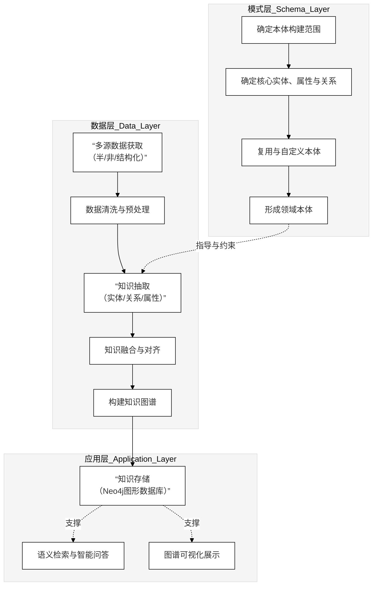

flowchart LR
    %% ===============================
    %% BERT 模型总体结构示意图
    %% ===============================

    %% 输入层
    subgraph INPUT["输入层（Input Layer）"]
        direction LR
        T["原始文本序列 Raw Text"]
        S["分词与子词切分 Tokenization / Subword Segmentation"]
        ID["词表映射 Token IDs"]
        SEG["句子标记 Segment IDs"]
        POS["位置索引 Position Indices"]
        MASK["注意力掩码 Attention Mask"]
        T --> S --> ID
        ID --> SEG
        ID --> POS
        ID --> MASK
    end

    %% 嵌入层
    subgraph EMB["嵌入层（Embedding Layer）"]
        direction LR
        WE["词嵌入 Token Embeddings"]
        SE["句段嵌入 Segment Embeddings"]
        PE["位置嵌入 Position Embeddings"]
        ADD["向量相加与归一化 Element-wise Sum & LayerNorm"]
        WE --> ADD
        SE --> ADD
        PE --> ADD
    end

    %% 多层 Transformer Encoder
    subgraph ENC["编码层（L 层 Transformer Encoder）"]
        direction TB

        subgraph L1["第 1 层 Encoder Layer"]
            direction TB
            A1["多头自注意力 Multi-Head Self-Attention"]
            R1["残差连接 + 层归一化 Residual + LayerNorm"]
            F1["前馈网络 Position-wise FFN"]
            R1b["残差连接 + 层归一化 Residual + LayerNorm"]
            A1 --> R1 --> F1 --> R1b
        end

        subgraph L2["第 2 层 Encoder Layer"]
            direction TB
            A2["多头自注意力"]
            R2["残差连接 + 层归一化"]
            F2["前馈网络"]
            R2b["残差连接 + 层归一化"]
            A2 --> R2 --> F2 --> R2b
        end

        %% 省略中间层，仅示意
        DOTS["⋮ 重复 L 次 Encoder 层结构"]

        subgraph LL["第 L 层 Encoder Layer"]
            direction TB
            AL["多头自注意力"]
            RL["残差连接 + 层归一化"]
            FL["前馈网络"]
            RLb["残差连接 + 层归一化"]
            AL --> RL --> FL --> RLb
        end

        L1 --> L2 --> DOTS --> LL
    end

    %% 预训练与下游任务头
    subgraph HEAD["预训练任务与下游任务头（Task Heads）"]
        direction TB
        CLS["[CLS] 向量 Sentence-level Representation"]
        TOK["序列向量 Token-level Representations"]

        MLM["掩码语言模型头 Masked Language Modeling Head"]
        NSP["下一句预测 / 句对分类头 Next Sentence Prediction / Sequence Classification Head"]
        NER["序列标注 / 下游任务头 Token-level Classification Head (

