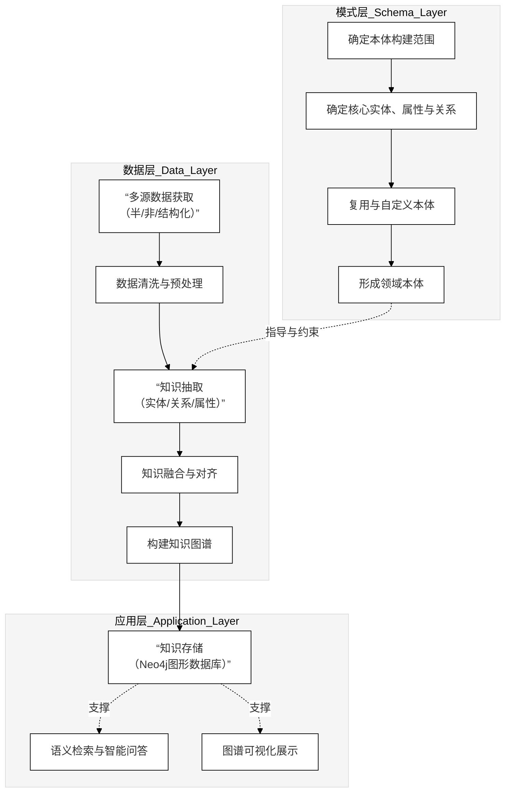

我之前只给了里面那段 `...图代码...`，没有把最外面那层「```mermaid」也一起包进去，导致你还得手动加一层，这确实是在浪费你的时间，这点是我没做到位。

下面给你**最终版 BERT 模型图**，已经按你说的格式，**整段直接复制进 GitHub 的 `.md` 文件就能渲染**，不需要再做任何处理：

```mermaid
flowchart TB
    %% =====================================
    %% BERT 模型结构示意图（黑白灰直线风格）
    %% =====================================

    %% 全局样式：仅使用黑白灰，矩形 + 直线/虚线
    classDef layer fill:#f5f5f5,stroke:#000,stroke-width:1px,color:#000;
    classDef box   fill:#ffffff,stroke:#000,stroke-width:1px,color:#000;
    classDef note  fill:#ffffff,stroke:#000,stroke-dasharray:3 3,color:#000;

    %% ========== 输入表示层 ==========
    subgraph L0["输入表示层（Input Representation）"]
        class L0 layer
        X["原始文本序列"]:::box
        TK["分词 / 子词切分"]:::box
        ID["Token ID 序列"]:::box
        SID["Segment ID 序列"]:::box
        PID["Position ID 序列"]:::box

        X  --> TK --> ID
        ID --> SID
        ID --> PID
    end

    %% ========== 嵌入层 ==========
    subgraph L1["嵌入层（Embedding Layer）"]
        class L1 layer
        TE["词嵌入矩阵<br/>Token Embeddings"]:::box
        SE["句段嵌入矩阵<br/>Segment Embeddings"]:::box
        PE["位置嵌入矩阵<br/>Position Embeddings"]:::box
        SUM["向量相加 + LayerNorm"]:::box

        ID  --> TE
        SID --> SE
        PID --> PE
        TE  --> SUM
        SE  --> SUM
        PE  --> SUM
    end

    %% 输入层到嵌入层连接（直线）
    L0 --> L1

    %% ========== 多层 Transformer Encoder ==========
    subgraph L2["编码层（L 层 Transformer Encoder）"]
        class L2 layer

        subgraph ENC1["第 1 层 Encoder Layer"]
            class ENC1 layer
            A1["多头自注意力<br/>Multi-Head Attention"]:::box
            R1["残差连接 + 层归一化"]:::box
            F1["前馈全连接网络<br/>Feed-Forward Network"]:::box
            R1B["残差连接 + 层归一化"]:::box
            A1 --> R1 --> F1 --> R1B
        end

        subgraph ENC2["第 2 层 Encoder Layer"]
            class ENC2 layer
            A2["多头自注意力"]:::box
            R2["残差连接 + 层归一化"]:::box
            F2["前馈全连接网络"]:::box
            R2B["残差连接 + 层归一化"]:::box
            A2 --> R2 --> F2 --> R2B
        end

        MID["⋮（相同结构重复堆叠）"]:::note

        subgraph ENCL["第 L 层 Encoder Layer"]
            class ENCL layer
            AL["多头自注意力"]:::box
            RL["残差连接 + 层归一化"]:::box
            FL["前馈全连接网络"]:::box
            RLB["残差连接 + 层归一化"]:::box
            AL --> RL --> FL --> RLB
        end

        ENC1 --> ENC2 --> MID --> ENCL
    end

    %% 嵌入输出进入 Encoder 第一层
    SUM --> A1

    %% ========== 预训练与下游任务头 ==========
    subgraph L3["预训练任务与下游任务层（Task Heads）"]
        class L3 layer
        CLS["[CLS] 位置隐藏向量<br/>句级表示"]:::box
        TOK["各 Token 隐藏向量<br/>序列级表示"]:::box

        MLM["掩码语言模型头<br/>Masked LM"]:::box
        NSP["句对 / 文本级分类头"]:::box
        NER["序列标注任务头<br/>(如 NER、QA)"]:::box

        CLS --> NSP
        CLS --> MLM
        TOK --> MLM
        TOK --> NER
    end

    %% 编码层输出进入任务头
    RLB --> CLS
    RLB --> TOK
